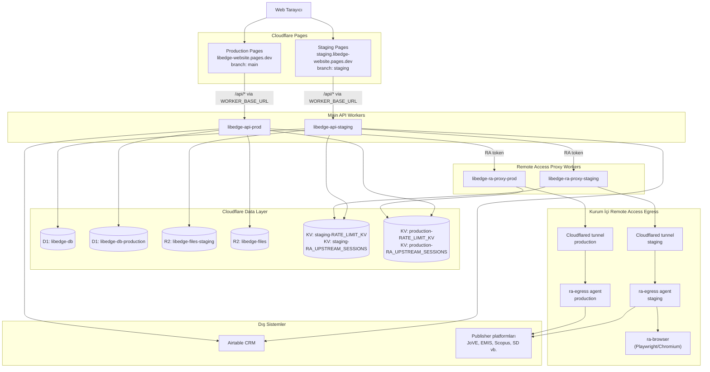

# LibEdge — Proje Mimarisi

Son güncelleme: 22 Mayıs 2026  
Sürüm: 3.0 — Sistem genel bakış + RA teknik detaylar birleştirildi

Bu doküman LibEdge web uygulamasının Cloudflare mimarisini, staging/production ayrımını,
veri akışlarını, Remote Access teknik detaylarını ve operasyon notlarını özetler.
Secret değerleri bu dokümana yazılmaz; yalnızca secret adları ve bağlı oldukları bileşenler listelenir.

---

## 1. Genel Bakış

LibEdge şu anda Cloudflare Pages, Workers, D1, R2 ve KV üzerinde çalışan statik frontend + API Worker mimarisine sahiptir.

| Ortam | Pages Domain | API Worker | Amaç |
|---|---|---|---|
| Staging | `staging.libedge-website.pages.dev` | `libedge-api-staging` | Test ve doğrulama |
| Production | `libedge-website.pages.dev` | `libedge-api-prod` | Canlı ortam |

Remote Access için ek bileşenler: RA Proxy Worker + ra-egress Go agent (Named Tunnel).

---

## 2. Sistem Diyagramı



---

## 3. Cloudflare Kaynakları

### 3.1 Pages

| Alan | Değer |
|---|---|
| Project | `libedge-website` |
| Production branch | `main` |
| Preview branch | `staging` |
| Production domain | `https://libedge-website.pages.dev` |
| Staging alias | `https://staging.libedge-website.pages.dev` |
| Build command | `npm run build:css` |

### 3.2 Main API Workers

| Ortam | Worker | URL |
|---|---|---|
| Staging | `libedge-api-staging` | `https://libedge-api-staging.agursel.workers.dev` |
| Production | `libedge-api-prod` | `https://libedge-api-prod.agursel.workers.dev` |

### 3.3 Remote Access Proxy Workers

| Ortam | Worker | Proxy Host |
|---|---|---|
| Staging | `libedge-ra-proxy-staging` | `proxy-staging.selmiye.com` / `*.selmiye.com` |
| Production | `libedge-ra-proxy-prod` | `proxy.selmiye.com` / `*.selmiye.com` |

### 3.4 D1 Veritabanları

| Ortam | Binding | Database | UUID |
|---|---|---|---|
| Staging | `DB` | `libedge-db` | `207d80d6-7e6b-4e10-aacf-b218970dbaf8` |
| Production | `DB` | `libedge-db-production` | `64e57edf-8163-4495-8874-fec00485b2ff` |

### 3.5 R2 Bucket'ları

| Ortam | Binding | Bucket |
|---|---|---|
| Staging | `FILES_BUCKET` | `libedge-files-staging` |
| Production | `FILES_BUCKET` | `libedge-files` |

### 3.6 KV Namespace'leri

| Ortam | Binding | Namespace |
|---|---|---|
| Staging | `RATE_LIMIT_KV` | `staging-RATE_LIMIT_KV` |
| Staging | `RA_UPSTREAM_SESSIONS` | `staging-RA_UPSTREAM_SESSIONS` |
| Production | `RATE_LIMIT_KV` | `production-RATE_LIMIT_KV` |
| Production | `RA_UPSTREAM_SESSIONS` | `production-RA_UPSTREAM_SESSIONS` |

---

## 4. Environment Ayrımı

| Bileşen | Staging | Production |
|---|---|---|
| Pages domain | `staging.libedge-website.pages.dev` | `libedge-website.pages.dev` |
| Main Worker | `libedge-api-staging` | `libedge-api-prod` |
| Proxy Worker | `libedge-ra-proxy-staging` | `libedge-ra-proxy-prod` |
| D1 | `libedge-db` | `libedge-db-production` |
| R2 | `libedge-files-staging` | `libedge-files` |
| RA proxy host | `proxy-staging.selmiye.com` | `proxy.selmiye.com` |

---

## 5. Secret'lar

### 5.1 Main API Worker Secret'ları

| Secret | Kullanım |
|---|---|
| `JWT_SECRET` | Auth access/refresh token imzalama |
| `R2_PUBLIC_URL` | R2 dosya URL üretimi |
| `AIRTABLE_PAT` | Airtable API erişimi |
| `RA_PROXY_TOKEN_SECRET` | Main API ile RA Proxy arasında token imzalama |
| `RA_CREDS_MASTER_KEY` | RA credential encryption |
| `RA_EGRESS_DEFAULT_SECRET` | RA egress HMAC shared secret |

### 5.2 RA Proxy Worker Secret'ları

| Secret | Kullanım |
|---|---|
| `RA_PROXY_TOKEN_SECRET` | Main API'den gelen proxy token doğrulama |
| `RA_CREDS_MASTER_KEY` | Credential çözme/şifreleme |
| `RA_EGRESS_DEFAULT_SECRET` | Egress agent ile güvenli iletişim |

---

## 6. Kod ve Repo Yapısı

```text
libedge-website/
├── backend/
│   └── src/
│       ├── index.js               ← Ana API (auth, admin, subscriptions, files, RA)
│       ├── ra/
│       │   ├── crypto.js
│       │   ├── host.js
│       │   ├── jwt.js
│       │   └── proxy-url.js
│       └── routes/
│           └── ra/
│               ├── admin-tunnel.js
│               ├── egress-allowed-hosts.js
│               └── issue-token.js
├── workers/
│   └── proxy/
│       └── src/
│           ├── index.js           ← Proxy Worker (session_host_proxy + path_proxy)
│           ├── egress-client.js   ← egressFetch, browserFetch, assetBrowserFetch
│           ├── alert-writer.js
│           ├── error-page.js
│           └── rate-limit.js
├── ra-egress/                     ← Go egress agent + Docker setup
│   ├── main.go
│   ├── Dockerfile
│   └── docker-compose.yml
├── ra-browser/                    ← Playwright/Chromium service (WAF bypass)
│   └── server.js
├── migrations/                    ← D1 SQL migrations (0001–0040+)
├── index.html / admin.html / profile.html / tools.html
└── package.json
```

---

## 7. Ana Veri Akışları

### 7.1 Normal Kullanıcı

```
Kullanıcı → Cloudflare Pages → /api/* → libedge-api-* → D1 / R2 / KV
```

### 7.2 Login ve Oturum

```
POST /api/auth/login → D1 users → JWT access (1h) + refresh token (7 gün) → httpOnly cookie
```

Refresh token replay protection: `refresh_tokens` tablosunda `jti` hash tutulur, refresh'te rotate edilir.

### 7.3 Remote Access

```
Kullanıcı
  → POST /api/ra/issue-token
  → libedge-api-* kısa ömürlü JWT üretir, KV'a session yazar
  → Redirect: https://r{sid}.selmiye.com{landingPath}?t={JWT}
  → Proxy Worker token doğrular, cookie set eder
  → Proxy Worker upstream'e egressFetch / browserFetch / assetBrowserFetch ile iletir
  → ra-egress agent → publisher platformu
```

---

## 8. Önemli API Endpoint'leri

| Method | Path | Açıklama | Auth |
|---|---|---|---|
| `POST` | `/api/auth/login` | Giriş | Yok |
| `POST` | `/api/auth/refresh` | Token yenileme | Refresh token |
| `POST` | `/api/auth/logout` | Çıkış | Var |
| `GET` | `/api/user/profile` | Profil | Var |
| `GET` | `/api/announcements` | Duyuru listesi | Yok |
| `POST` | `/api/ra/issue-token` | RA token üretimi | Var |
| `GET` | `/api/ra/egress/allowed-hosts` | Egress host listesi | Service key |
| `GET` | `/api/admin/dashboard` | Admin | Admin |

---

## 9. Deployment Komutları

### 9.1 Main API Worker

```powershell
npx wrangler deploy --env staging
npx wrangler deploy --env production
```

### 9.2 RA Proxy Worker

```powershell
cd workers/proxy
npx wrangler deploy --env staging
npx wrangler deploy --env production
```

### 9.3 D1 Migration

```powershell
npx wrangler d1 migrations apply libedge-db --env staging --remote
npx wrangler d1 migrations apply libedge-db-production --env production --remote
```

### 9.4 Log Tail

```powershell
npx wrangler tail --env staging --format pretty
npx wrangler tail libedge-ra-proxy-staging --format pretty
```

### 9.5 ra-browser Rebuild

```powershell
cd ra-egress
docker compose build --no-cache ra-browser
docker compose up -d --force-recreate ra-browser
```

---

## 10. Güncel Durum (22 Mayıs 2026)

| Bileşen | Staging | Production |
|---|---|---|
| Pages | Aktif | Aktif |
| Main API Worker | Aktif | Aktif |
| RA Proxy Worker | Aktif (`c7d0c78a` + `770b5da5`) | Deployed (Step 07 bekliyor) |
| ra-egress | Aktif | Aktif |
| ra-browser | Aktif (Referer fix rebuild edildi) | — |
| D1 migrations | 0040 uygulandı | Prod-07 sonrası uygulanacak |
| Scopus RA | Search ✅, SD full text ✅ | — |
| Cloudflare block | Geçici (test trafiği) — 30-60 dk | — |

---

## 11. Remote Access — Teknik Detaylar

### 11.1 session_host_proxy Akışı

```
[Kullanıcı tarayıcı]
  │  POST /api/ra/issue-token
  ▼
[libedge-api-* Worker]
  │  - Abonelik: ra_delivery_mode, ra_origin_landing_path
  │  - JWT sign: sub, iid, sid, pid, jti, mod, exp
  │  - KV yaz: rhost:{sessionId} → {origin_host, institution_id, expires_at}
  │  - Redirect: https://r{sid}.selmiye.com{path}?t={JWT}
  ▼
[Tarayıcı → r{sid}.selmiye.com?t=JWT]
  │
  ▼
[libedge-ra-proxy-* Worker]
  │  - JWT verify, JTI tek kullanımlık kontrol
  │  - 302 + Set-Cookie: ra_proxy_session={sid}
  ▼
[Tarayıcı → r{sid}.selmiye.com (cookie ile)]
  │
  ▼
[Proxy Worker]
  │  - KV'dan session yükle
  │  - buildUpstreamHeaders()
  │  - egressFetch / browserFetch / assetBrowserFetch seç
  ▼
[ra-egress → ra-browser (gerekirse)]
  │  - HMAC verify, ALLOWED_HOST_REGEX kontrol
  │  - publisher'a HTTP(S) istek (kurum IP'siyle)
  ▼
[Publisher]
```

### 11.2 Egress Routing Mantığı

| Koşul | Yol |
|---|---|
| `isGet && isDocNav && needsPlaywright` | `browserFetch` (Playwright tam sayfa) |
| `isGet && !isDocNav && needsPlaywright` | `assetBrowserFetch` (Chrome TLS, cache'den) |
| `!isGet && PLAYWRIGHT_SLUGS içinde` | `assetBrowserFetch` (POST, Chrome TLS) |
| Diğer | `egressFetch` (Go HTTP client) |

`PLAYWRIGHT_SLUGS` = `cab-abstracts`, `wiley`, `scopus` — CF Bot Management gerektiren ürünler.

### 11.3 egressFetch — HMAC İmzalama

```
msg = "{METHOD}|{targetURL}|{timestamp}|{body_sha256_hex}"
sig = HMAC-SHA256(msg, egress_secret)

Headers:
  X-RA-Target-URL:  https://www.scopus.com/...
  X-RA-Method:      POST
  X-RA-Timestamp:   {unix_ts}
  X-RA-Signature:   {hex}
```

Secret öncelik: D1 `egress_secret_enc` (AES-GCM) → `RA_EGRESS_DEFAULT_SECRET` env → hata.

### 11.4 Proxy Worker — Header Politikası

**Upstream'e gönderilen:**
- Tüm browser cookie'leri (`ra_proxy_session` hariç)
- Origin ve Referer → proxy domain'den publisher origin'e rewrite
- CF runtime header'ları strip: `cf-connecting-ip`, `cf-ray`, `x-forwarded-for` vb.
- EMIS: upstream'e desktop User-Agent / Client Hints gönderilir

**Publisher'dan gelen response:**
- Set-Cookie → domain `r*.selmiye.com`, path `/` olarak rewrite
- Location → `r*.selmiye.com` subdomain'e rewrite
- CSP, HSTS strip

### 11.5 Multi-Host Publisher Routing

Bazı yayıncılar (EMIS, CAS SciFinder) birden fazla host kullanır. Allowlist'teki alt-hostlar
`/__ra-host/{encoded-host}/` prefix'i altında taşınır:

```
https://r{sid}.selmiye.com/__ra-host/cas-emis-com/login
https://r{sid}.selmiye.com/__ra-host/sso-cas-org/as/...
```

OIDC `redirect_uri` parametresi değiştirilmez; SSO callback orijinal host adresine kalır.

### 11.6 Session-Host Cookie Jar

CAS/OIDC gibi çok adımlı akışlarda bazı cookie'ler browser request'inde eksik kalabilir.
`RA_UPSTREAM_SESSIONS` KV'da session+host bazlı jar:

```
rhostjar:{sessionId}:{targetHost} → "nonce.xxx=...; PF=..."
```

Her upstream Set-Cookie bu jar'a işlenir; sonraki upstream request'te jar browser
cookie'lerinden önce eklenir.

### 11.7 Publisher Cookie Scoping

Elsevier ürünleri (ScienceDirect, Scopus) için cookie'ler `__cp_{scopeHost}|{name}` prefix'iyle
namespace'lenir. Bu sayede farklı publisher oturumlarının cookie'leri çakışmaz.

Scopus için namespace script devre dışı (`publisherCookieScopeHost !== 'scopus.com'` koşulu) —
Next.js hydration uyumu için.

### 11.8 Rate Limit

| Kapsam | Varsayılan |
|---|---:|
| Proxy session | 300 istek/dk |
| Kurum | 5000 istek/dk |
| Pencere | 60 sn |

429 + `Retry-After` döner. KV hatasında fail-open (yayıncı erişimi kesilmez).

### 11.9 ra-egress Go Agent

**Env değişkenleri:**

| Değişken | Açıklama |
|---|---|
| `EGRESS_SHARED_SECRET` | HMAC key — proxy Worker ile eşleşmeli |
| `ALLOWED_HOST_REGEX` | SSRF koruması, geniş fallback tüm RA ailelerini kapsar |
| `LIBEDGE_API_URL` | Dinamik host listesi için API endpoint |
| `LIBEDGE_SERVICE_KEY` | API servis anahtarı |
| `LIBEDGE_INSTITUTION_ID` | Kurum bazlı host filtreleme |
| `TUNNEL_TOKEN` | Cloudflare Named Tunnel token |

TLS: Go `net/tls` (HTTP/2 devre dışı — AWS WAF uyumu) + `utls` Chrome fingerprint
(Cloudflare korumalı yayıncılar için — ACS, Wiley, Scopus, CABI).

### 11.10 ra-browser (Playwright/Chromium)

CF Bot Management korumalı yayıncılar için Playwright tabanlı Chrome servisi.

- `GET /proxy` → tam sayfa navigasyon (CF Turnstile çözme)
- `POST /proxy` + `X-RA-Asset: 1` → sub-resource fetch (Chrome TLS, cache servis)

Sub-resource cache: sayfa yüklemesinde yakalanan CSS/JS/image'lar 5 dk cache'de tutulur;
asset-proxy istekleri cache'den servis edilir (upstream'e yeni istek atmadan).

**Önemli:** `passHeaders` (Referer, Accept, vb.) artık `context.request.get()` çağrısına
iletiliyor — önceki eksiklik doc-details gibi CSRF/Referer kontrollü API'lerde 403'e yol açıyordu.

---

## 12. Çözülen Teknik Sorunlar

| Sorun | Çözüm |
|---|---|
| AWS WAF HTTP/2 fingerprint (JoVE) | ra-egress'te HTTP/2 devre dışı, HTTP/1.1 zorunlu |
| Cloudflare Bot Management (ACS, Wiley, Scopus, CABI) | utls Chrome TLS fingerprint + Playwright/ra-browser |
| iOS Safari popup blocker | `window.open('')` await'ten önce açılıyor, URL sonra set ediliyor |
| EMIS multi-host session | `__ra-host/{encoded}` prefix routing |
| CAS SciFinder OIDC callback 403 | Session-host upstream cookie jar (KV) |
| Proxy session invalid header | safeHeaders() + response header sanitization |
| Scopus hydration flash | `__NEXT_DATA__` hostname patch server-side |
| doc-details 403 | ra-browser passHeaders fix (Referer, Accept) |

---

## 13. Yeni Ürün Onboarding Reçetesi

### 13.1 Gerekli D1 Alanları

```sql
UPDATE products
SET
  ra_enabled = 1,
  ra_delivery_mode = 'session_host_proxy',
  ra_origin_host = '{primary-host}',
  ra_origin_landing_path = '{entry-path}',
  ra_host_allowlist_json = '["{primary-host}", "{auth-host}", "..."]',
  ra_waf_browser = 0  -- CF Bot Management varsa 1
WHERE slug = '{product-slug}';
```

### 13.2 Kontrol Listesi

1. Kurum IP'sinden incognito test: entry URL → son URL not al
2. DevTools Network: `302 Location`, `Set-Cookie`, auth/CDN hostları listele
3. `ra_host_allowlist_json`: yalnızca akışta gereken hostlar
4. `ALLOWED_HOST_REGEX` fallback bu hostları kapsıyor mu?
5. `ra_waf_browser=1` gerekiyor mu? (CF Bot Management varsa)
6. Proxy test: `X-RA-Debug-Upstream-Status`, `Set-Cookies` header'ları
7. Mobil test: desktop-UA override gerekip gerekmediğini değerlendir

### 13.3 Ürün Bazlı Özel Durumlar

| Ürün | Özel durum | Çözüm |
|---|---|---|
| JoVE | AWS WAF HTTP/2 | HTTP/2 kapalı (h1Client) |
| EMIS | CAS multi-host, mobil API | `__ra-host` routing + desktop-UA |
| ACS | Cloudflare Bot Management | utls Chrome fingerprint |
| Wiley | CF Bot Management + persistent session | ra-browser + Step 06 (persistent pool) |
| Scopus | CF Bot Management, Next.js hydration | ra-browser + passHeaders + `__NEXT_DATA__` patch |
| ScienceDirect | Elsevier cookie namespace | `__cp_sciencedirect.com\|` prefix |
| CAS SciFinder | OIDC SSO cross-origin | `__ra_upstream` + cookie jar |

---

## 14. Hızlı Referans

```text
Staging site:      https://staging.libedge-website.pages.dev
Production site:   https://libedge-website.pages.dev
Staging API:       https://libedge-api-staging.agursel.workers.dev
Production API:    https://libedge-api-prod.agursel.workers.dev
Staging proxy:     proxy-staging.selmiye.com / *.selmiye.com
Production proxy:  proxy.selmiye.com / *.selmiye.com (Step 07'yi bekliyor)

Kritik dosyalar:
  workers/proxy/src/index.js        ← Proxy Worker
  workers/proxy/src/egress-client.js ← egressFetch / browserFetch / assetBrowserFetch
  backend/src/routes/ra/issue-token.js
  ra-egress/main.go
  ra-browser/server.js
```
