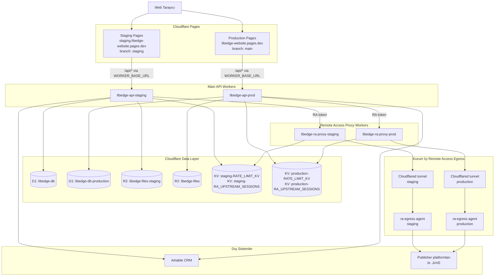

# LibEdge - Güncel Proje Mimarisi

Son güncelleme: 23 Nisan 2026  
Sürüm: 2.0, Worker yeniden adlandırma sonrası mimari

Bu doküman LibEdge web uygulamasının güncel Cloudflare mimarisini, staging/production ayrımını, veri akışlarını ve operasyon notlarını özetler. Secret değerleri bu dokümana yazılmaz; yalnızca secret adları ve bağlı oldukları bileşenler listelenir.

## 1. Genel Bakış

LibEdge şu anda Cloudflare Pages, Cloudflare Workers, D1, R2 ve KV üzerinde çalışan statik frontend + API Worker mimarisine sahiptir.

Ana uygulama iki ortama ayrılmıştır:

| Ortam | Pages Domain | API Worker | Amaç |
|---|---|---|---|
| Staging | `staging.libedge-website.pages.dev` | `libedge-api-staging` | Test ve doğrulama |
| Production | `libedge-website.pages.dev` | `libedge-api-prod` | Canlı ortam |

Eski `form-handler-*` Worker'ları şu anda kullanılmıyor, fakat rollback için geçici olarak Cloudflare üzerinde tutuluyor.

## 2. Sistem Diyagramı



## 3. Cloudflare Kaynakları

### 3.1 Pages

| Alan | Değer |
|---|---|
| Project | `libedge-website` |
| Production branch | `main` |
| Preview branch | `staging` |
| Production domain | `https://libedge-website.pages.dev` |
| Staging alias | `https://staging.libedge-website.pages.dev` |
| Pages Functions | `functions/api/[[path]].js` |
| Build command | `npm run build:css` |
| Node version | `20` |

Pages API proxy mantığı:

```text
Pages /api/*
  -> functions/api/[[path]].js
  -> env.WORKER_BASE_URL
  -> ilgili API Worker
```

### 3.2 Main API Workers

| Ortam | Worker | URL | Durum |
|---|---|---|---|
| Staging | `libedge-api-staging` | `https://libedge-api-staging.agursel.workers.dev` | Aktif |
| Production | `libedge-api-prod` | `https://libedge-api-prod.agursel.workers.dev` | Aktif |

Eski Worker'lar:

| Worker | Durum | Not |
|---|---|---|
| `form-handler-staging` | Pasif | Rollback için tutuluyor |
| `form-handler-prod` | Pasif | Rollback için tutuluyor |

### 3.3 Remote Access Proxy Workers

| Ortam | Worker | Proxy Host | Durum |
|---|---|---|---|
| Staging | `libedge-ra-proxy-staging` | `proxy-staging.selmiye.com` | Deployed |
| Production | `libedge-ra-proxy-prod` | `proxy.selmiye.com` | Deployed |

### 3.4 D1 Veritabanları

| Ortam | Binding | Database | UUID |
|---|---|---|---|
| Staging/default | `DB` | `libedge-db` | `207d80d6-7e6b-4e10-aacf-b218970dbaf8` |
| Production | `DB` | `libedge-db-production` | `64e57edf-8163-4495-8874-fec00485b2ff` |

### 3.5 R2 Bucket'ları

| Ortam | Binding | Bucket |
|---|---|---|
| Staging | `FILES_BUCKET` | `libedge-files-staging` |
| Production | `FILES_BUCKET` | `libedge-files` |

Ek bucket:

| Bucket | Not |
|---|---|
| `test` | Ana akışta kullanılmıyor gibi görünüyor |

### 3.6 KV Namespace'leri

| Ortam | Binding | Namespace |
|---|---|---|
| Staging | `RATE_LIMIT_KV` | `staging-RATE_LIMIT_KV` |
| Staging | `RA_UPSTREAM_SESSIONS` | `staging-RA_UPSTREAM_SESSIONS` |
| Production | `RATE_LIMIT_KV` | `production-RATE_LIMIT_KV` |
| Production | `RA_UPSTREAM_SESSIONS` | `production-RA_UPSTREAM_SESSIONS` |
| Default | `RATE_LIMIT_KV` | `RATE_LIMIT_KV` |
| Default | `RA_UPSTREAM_SESSIONS` | `RA_UPSTREAM_SESSIONS` |

Diğer görünen namespace'ler:

| Namespace | Not |
|---|---|
| `VIEW_COUNTS` | Eski veya ayrı view counter akışı olabilir |
| `__silent-mountain-f3bf-workers_sites_assets` | Eski Workers Sites asset namespace'i olabilir |

## 4. Environment Ayrımı

| Bileşen | Staging | Production |
|---|---|---|
| Pages domain | `staging.libedge-website.pages.dev` | `libedge-website.pages.dev` |
| Pages branch | `staging` | `main` |
| Pages `WORKER_BASE_URL` | `https://libedge-api-staging.agursel.workers.dev` | `https://libedge-api-prod.agursel.workers.dev` |
| Main Worker | `libedge-api-staging` | `libedge-api-prod` |
| Proxy Worker | `libedge-ra-proxy-staging` | `libedge-ra-proxy-prod` |
| D1 | `libedge-db` | `libedge-db-production` |
| R2 | `libedge-files-staging` | `libedge-files` |
| Rate limit KV | `staging-RATE_LIMIT_KV` | `production-RATE_LIMIT_KV` |
| RA sessions KV | `staging-RA_UPSTREAM_SESSIONS` | `production-RA_UPSTREAM_SESSIONS` |
| RA proxy host | `proxy-staging.selmiye.com` | `proxy.selmiye.com` |

## 5. Secret'lar

### 5.1 Main API Worker Secret'ları

Her ortamda ayrı tutulur:

| Secret | Kullanım |
|---|---|
| `JWT_SECRET` | Auth access/refresh token imzalama |
| `R2_PUBLIC_URL` | R2 dosya URL üretimi |
| `AIRTABLE_PAT` | Airtable API erişimi |
| `AIRTABLE_BASE_ID` | Airtable base seçimi |
| `RA_PROXY_TOKEN_SECRET` | Main API ile RA Proxy arasında token imzalama |
| `RA_CREDS_MASTER_KEY` | RA credential encryption |
| `RA_EGRESS_DEFAULT_SECRET` | RA egress HMAC/shared secret |

### 5.2 RA Proxy Worker Secret'ları

| Secret | Kullanım |
|---|---|
| `RA_PROXY_TOKEN_SECRET` | Main API'den gelen proxy token doğrulama |
| `RA_CREDS_MASTER_KEY` | Credential çözme/şifreleme uyumu |
| `RA_EGRESS_DEFAULT_SECRET` | Egress agent ile güvenli iletişim |

### 5.3 Pages Environment Variables

| Ortam | Değişken | Tip | Değer |
|---|---|---|---|
| Preview | `WORKER_BASE_URL` | Plaintext | `https://libedge-api-staging.agursel.workers.dev` |
| Production | `WORKER_BASE_URL` | Plaintext | `https://libedge-api-prod.agursel.workers.dev` |
| Preview/Production | `NODE_VERSION` | Plaintext | `20` |

Production tarafında ayrıca `JWT_SECRET`, `GITHUB_CLIENT_ID`, `GITHUB_CLIENT_SECRET` gibi Pages secret'ları görünüyor. Mevcut API proxy akışında ana kritik değer `WORKER_BASE_URL`'dir.

## 6. Kod ve Repo Yapısı

```text
libedge-website/
├── backend/
│   └── src/
│       ├── index.js
│       ├── institution-logo-map.js
│       ├── ra/
│       │   ├── crypto.js
│       │   ├── host.js
│       │   ├── jwt.js
│       │   └── schema.js
│       └── routes/
│           └── ra/
│               ├── admin-tunnel.js
│               └── issue-token.js
├── functions/
│   └── api/
│       └── [[path]].js
├── workers/
│   └── proxy/
│       ├── src/
│       │   ├── egress-client.js
│       │   ├── index.js
│       │   └── upstream.js
│       └── wrangler.toml
├── ra-egress/
│   ├── main.go
│   ├── Dockerfile
│   ├── docker-compose.yml
│   ├── go.mod
│   └── README.md
├── migrations/
│   ├── 0001_initial_schema.sql
│   ├── 0015_remote_access.sql
│   ├── 0016_page_views.sql
│   └── ...
├── assets/
├── partials/
├── index.html
├── admin.html
├── profile.html
├── announcements.html
├── style.css
├── wrangler.toml
└── package.json
```

Not: `backend/src/index.js` şu an ana API'nin büyük bölümünü taşıyan merkezi dosyadır. Auth, admin, subscriptions, files, announcements, support, Airtable sync ve page views endpoint'leri burada bulunur. RA endpoints kısmen ayrı route dosyalarına ayrılmıştır.

## 7. Ana Veri Akışları

### 7.1 Normal Kullanıcı Akışı

```text
Kullanıcı
  -> Cloudflare Pages
  -> /api/* Pages Function
  -> libedge-api-*
  -> D1 / R2 / KV
  -> Response
```

### 7.2 Login ve Oturum

```text
POST /api/auth/login
  -> D1 users tablosu
  -> JWT access token + refresh token
  -> httpOnly cookie
```

### 7.3 Admin ve Dosya Yönetimi

```text
Admin
  -> Pages admin.html
  -> /api/admin/*
  -> libedge-api-*
  -> R2 dosya içeriği
  -> D1 metadata
```

### 7.4 Duyurular

```text
Kullanıcı
  -> /api/announcements
  -> D1 announcements
  -> yorum / reaksiyon / engagement endpoint'leri
```

### 7.5 Page Views

```text
Frontend
  -> POST /api/views/batch
  -> D1 page_views
```

### 7.6 Remote Access

```text
Kullanıcı
  -> Pages profile/subscription ekranı
  -> POST /api/ra/issue-token
  -> libedge-api-* kısa ömürlü RA token üretir
  -> libedge-ra-proxy-*
  -> RA session KV
  -> cloudflared tunnel
  -> ra-egress agent
  -> publisher platformu
```

## 8. Önemli API Endpoint'leri

| Method | Path | Açıklama | Auth |
|---|---|---|---|
| `GET` | `/api/auth/status` | Health/status | Yok |
| `POST` | `/api/auth/login` | Kullanıcı girişi | Yok |
| `POST` | `/api/auth/logout` | Kullanıcı çıkışı | Var |
| `POST` | `/api/auth/refresh` | Token yenileme | Refresh token |
| `GET` | `/api/user/profile` | Profil bilgisi | Var |
| `GET` | `/api/announcements` | Duyuru listesi | Yok |
| `GET` | `/api/announcements/:id/engagement` | Duyuru engagement | Opsiyonel |
| `POST` | `/api/announcements/:id/reactions` | Reaksiyon | Var |
| `POST` | `/api/announcements/:id/comments` | Yorum | Var |
| `GET` | `/api/files/*` | R2 dosya servis endpoint'i | Dosya referansına göre |
| `POST` | `/api/files/upload` | Managed upload | Admin |
| `GET` | `/api/admin/dashboard` | Admin dashboard | Admin |
| `GET` | `/api/admin/users` | Kullanıcı listesi | Admin |
| `GET` | `/api/admin/institutions` | Kurum listesi | Admin |
| `POST` | `/api/admin/announcements` | Duyuru oluşturma | Super admin |
| `POST` | `/api/ra/issue-token` | RA token üretimi | Var |
| `GET` | `/api/ra/admin/institution-egress/:institution_id` | RA tunnel ayarı | Admin |
| `POST` | `/api/views/batch` | Toplu view sayımı | Yok |

## 9. Deployment Komutları

### 9.1 Main API Worker

```powershell
# Staging API deploy
npx wrangler deploy --env staging

# Production API deploy
npx wrangler deploy --env production
```

Bu komutlar kök `wrangler.toml` dosyasını kullanır:

```text
staging    -> libedge-api-staging
production -> libedge-api-prod
```

### 9.2 Pages Deploy

GitHub push ile otomatik deploy tercih edilir.

Manuel staging deploy gerektiğinde güncel dosyalardan temiz bir deploy klasörü hazırlanmalıdır:

```powershell
npx wrangler pages deploy .pages-deploy-current `
  --project-name libedge-website `
  --branch staging `
  --commit-dirty true `
  --commit-message "staging deploy"
```

Not: Eski `backups/pages-deploy` klasörü kullanılmamalıdır; güncel dosyaları geriye alabilir.

### 9.3 RA Proxy Worker

```powershell
cd workers/proxy

npx wrangler deploy --env staging
npx wrangler deploy --env production
```

### 9.4 D1 Migration

```powershell
npx wrangler d1 migrations apply libedge-db --env staging --remote
npx wrangler d1 migrations apply libedge-db-production --env production --remote
```

### 9.5 Secret Yönetimi

```powershell
npx wrangler secret list --env staging
npx wrangler secret put JWT_SECRET --env staging

npx wrangler secret list --env production
npx wrangler secret put JWT_SECRET --env production
```

Echo ile secret üretmek teknik olarak çalışır:

```powershell
echo "secret-value" | npx wrangler secret put JWT_SECRET --env staging
```

Ancak terminal history riski nedeniyle interaktif `secret put` kullanımı daha güvenlidir.

## 10. İzleme ve Smoke Test

### 10.1 Worker Health

```powershell
Invoke-WebRequest `
  -Uri "https://libedge-api-staging.agursel.workers.dev/api/auth/status" `
  -UseBasicParsing

Invoke-WebRequest `
  -Uri "https://libedge-api-prod.agursel.workers.dev/api/auth/status" `
  -UseBasicParsing
```

Beklenen sonuç:

```text
200 OK
{"status":"LibEdge Auth API çalışıyor", ...}
```

### 10.2 Public API

```powershell
Invoke-WebRequest `
  -Uri "https://libedge-api-prod.agursel.workers.dev/api/announcements" `
  -UseBasicParsing
```

### 10.3 Protected API

```powershell
Invoke-WebRequest `
  -Uri "https://libedge-api-prod.agursel.workers.dev/api/admin/runtime-info" `
  -UseBasicParsing `
  -SkipHttpErrorCheck
```

Beklenen sonuç, token yokken:

```text
403 Yetkisiz
```

### 10.4 Log Tail

```powershell
npx wrangler tail --env staging --format pretty
npx wrangler tail --env production --format pretty
```

Belirli Worker adıyla:

```powershell
npx wrangler tail libedge-api-staging --format pretty
npx wrangler tail libedge-api-prod --format pretty
```

## 11. Güncel Durum

| Bileşen | Staging | Production |
|---|---|---|
| Pages | Aktif | Aktif |
| Pages `WORKER_BASE_URL` | `libedge-api-staging` | `libedge-api-prod` |
| Main API Worker | Aktif | Aktif |
| API health | 200 OK | 200 OK |
| Announcements endpoint | 200 OK | 200 OK |
| D1 binding | Bağlı | Bağlı |
| R2 binding | Bağlı | Bağlı |
| KV binding | Bağlı | Bağlı |
| RA Proxy Worker | Deployed | Deployed |
| Eski `form-handler-*` | Rollback için duruyor | Rollback için duruyor |

## 12. Operasyon Notları ve Öneriler

### 12.1 Eski Worker'lar

`form-handler-staging` ve `form-handler-prod` artık ana akışta kullanılmamalı. Birkaç gün rollback için tutulabilir. Sonrasında şu sırayla kaldırılabilir:

1. Production ve staging Pages'in yeni API Worker'lara baktığı doğrulanır.
2. Login/logout, profile, admin, announcements, files ve RA smoke test yapılır.
3. Cloudflare dashboard veya Wrangler üzerinden eski Worker'lar silinir.

Örnek:

```powershell
npx wrangler delete --name form-handler-staging
npx wrangler delete --name form-handler-prod
```

Silmeden önce rollback ihtiyacının kalmadığından emin olunmalıdır.

### 12.2 Otomatik Test Eksikliği

Mevcut `npm test` gerçek otomatik test çalıştırmıyor; manuel smoke checklist yazdırıyor. Özellikle şu alanlara test eklenmesi önerilir:

| Alan | Önerilen Test |
|---|---|
| Auth | login, refresh, logout, expired token |
| Admin scope | kurum admin'inin yalnızca kendi kurumunu yönetmesi |
| File access | public/private dosya yetkileri |
| Announcements | public liste, admin CRUD, engagement |
| RA | issue-token, expired subscription, invalid access type |
| Migrations | fresh D1 kurulum smoke testi |

### 12.3 RA Migration/Schema Riski

RA tarafında migration dosyaları ile runtime schema guard arasında kolon isimleri açısından dikkat edilmesi gereken alanlar var. Özellikle `institution_ra_settings` tablosunun migration ile oluştuğu durumlarda runtime'ın beklediği kolonlar ayrıca doğrulanmalıdır.

Öneri:

```text
migrations/0015_remote_access.sql
backend/src/ra/schema.js
```

dosyaları tek kaynaklı ve idempotent olacak şekilde hizalanmalıdır.

### 12.4 R2 Dosya Erişim Modeli

`/api/files/*` endpoint'i R2 key üzerinden dosya servis ediyor. Dosya erişim kontrolü, D1'deki dosya referanslarına bağlıdır. Referansı olmayan R2 objeleri için beklenen güvenlik davranışı ayrıca netleştirilmelidir.

Öneri:

1. R2 key'leri tahmin edilemez kalmalı.
2. Referansı olmayan obje servis politikası açıkça belirlenmeli.
3. Ticket attachment, announcement cover, institution logo gibi özel path'ler ayrı değerlendirilmelidir.

### 12.5 Production Pages Smoke Test

Bu ortamdan `pages.dev` domainlerine yapılan bazı testlerde TLS/transport reset görüldü. Doğrudan Worker endpoint'leri sağlıklıydı. Production Pages üzerinden tarayıcıda şu kontroller yapılmalıdır:

```text
https://libedge-website.pages.dev/
https://libedge-website.pages.dev/api/auth/status
https://libedge-website.pages.dev/announcements.html
```

### 12.6 Dokümantasyon Bakımı

Bu dosya, Cloudflare kaynaklarında şu değişiklikler olduğunda güncellenmelidir:

| Değişiklik | Güncellenecek Bölüm |
|---|---|
| Worker adı değişirse | Main API Workers / Deployment |
| D1 veya R2 ayrımı değişirse | Cloudflare Kaynakları |
| Yeni secret eklenirse | Secret'lar |
| RA proxy host değişirse | Remote Access |
| Eski Worker'lar silinirse | Eski Worker'lar / Güncel Durum |

## 13. Hızlı Referans

```text
Staging site:
https://staging.libedge-website.pages.dev

Production site:
https://libedge-website.pages.dev

Staging API:
https://libedge-api-staging.agursel.workers.dev

Production API:
https://libedge-api-prod.agursel.workers.dev

Staging RA proxy:
proxy-staging.selmiye.com

Production RA proxy:
proxy.selmiye.com
```

